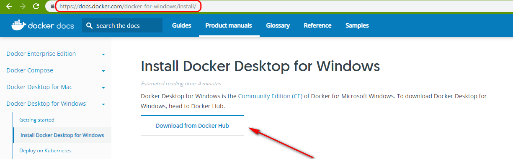

# Docker installation on Windows10

Docker is a computer program that performs operating-system-level virtualization, also known as "containerization". Docker allows you to install software quickly and without worrying about dependencies.
To use Docker images of software, you need to have Docker installed on your machine.

To check if you have Docker type in the terminal:
```
docker -v
```
If you do not see the version as an output, you need to install Docker. Most modern computes can run Docker, If you have any doubts, please check the [official documentation](https://docs.docker.com/).

### Downloading and installing Docker

Please visit the official page of [Docker Desktop for Windows](https://docs.docker.com/docker-for-windows/install/) and click the Download button.



You will be redirected to Dockerhub. You need to register and login to download the installation file.


The registration process is very simple and straightforward. After registering, enter you login and password.


You will be redirected to Dockerhub. Now the download button will be enabled.


Navigate to the directory where you saved the installation file. Double click the installation file.


Accept the defaults.


The installation will continue.


Open the terminal and type:
```
docker -v
```
You should see the similar output.


Navigate to the folder where you installed Docker and double click on the *Docker for Windows.exe* file.


Soon you will see a pop-up window. Enter your credentials.


### Pulling the container image
To run containers pull the container image:
```
docker pull registry.gitlab.com/librehealth/toolkit/lh-toolkit-docker:latest
```
You should see the similar console output:


Navigate to the directory where you cloned this project. Depending on how you want to interact with the container, run it in foreground or as a daemon.

To run the container in the foreground:
```
docker-compose -f docker-compose.dev.yml up
```


You may see a pop-up asking whether you want to share drive. Click *Share it* to continue.


MySQL will be started first and then lh-toolkit will be started on the containers.
When you are done using lh-toolkit you can press `Ctrl+C` to stop the container. Do not do this unless you want to stop Docker.


To run the container in the background:
```
docker-compose -f docker-compose.dev.yml up -d
```


## Using lh-toolkit
To start using lh-toolkit, point your browser to localhost:8080/lh-toolkit .
The following are the authentication information:

* **User**: admin
* **Pass**: Admin123


## Bringing container down
To bring the container down and to free space on your machine run:
```
docker-compose down
```


## Troubleshooting
When you are pulling the container image, the directory you are in does not matter.
However, if you try to run this docker image from outside of this project directory, you will get the following error:


Navigate to the project directory and enter the command again.

If you try to pull an image before starting the Docker daemon, you will see an error:


Navigate to the folder where you installed Docker and double click on the *Docker for Windows.exe* file.

You might see the following warning on the older systems:


Ignore it or update your system.